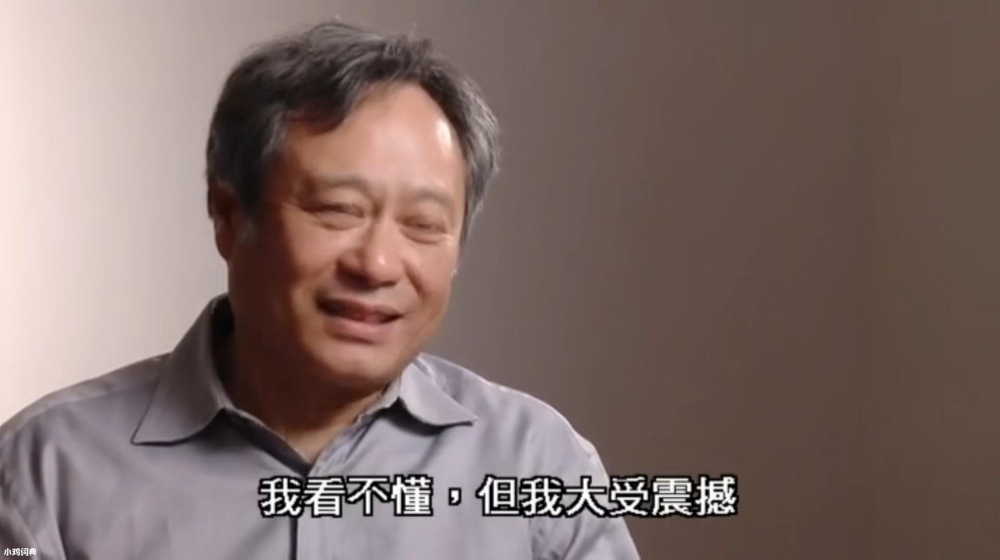

# 太极图形课S1-程序动画
模仿了ShaderToy中的一个样例，实现了一个程序动画。

## 背景简介
参考（zhaochao）了[这个链接](https://www.shadertoy.com/view/XdlSDs)中的Total Noob的Shader Toy，并且在Taichi中实现。这个Shader Toy获得了SIGGRAPH2014的ShaderToy大奖，很炫，并且实现起来非常简洁。

说实话我并没有完全理解程序当中的数学（特别是最后控制边缘高亮的弧度的变化的那一段），只能够猜个大概。也许这就是大神吧。

使用了handy_shader_functions中的一些函数，非常好用，Thanks♪(･ω･)ﾉ。

## 成功效果展示

## 运行方式
运行 `python3 noob.py`，录像 `python3 noob.py --record`
